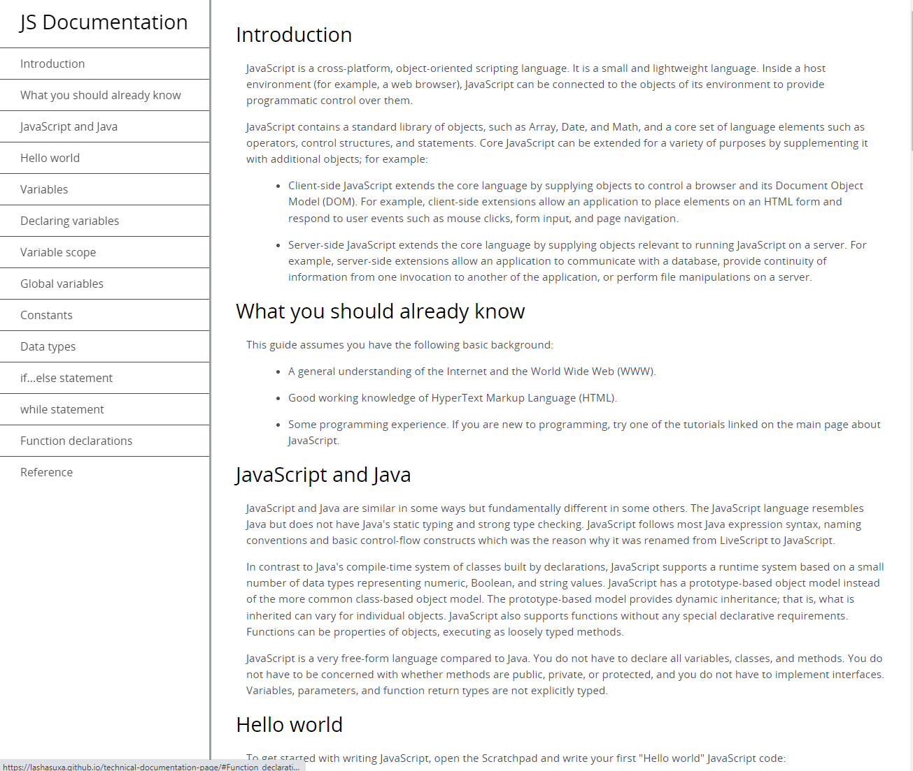

# Technical Documentation page - FreeCodeCamp

## Table of contents

- [Overview](#overview)
  - [Screenshot](#screenshot)
  - [Links](#links)
- [My process](#my-process)
  - [Built with](#built-with)
  - [What I learned](#what-i-learned)
  - [Useful resources](#useful-resources)
- [Author](#author)

## Overview

### Screenshot

### Links

- Solution URL: [Technical-Documentation-Page](https://github.com/lashasuxa/technical-documentation-page)
- Live Site URL: [Technical-Documentation-Page](https://lashasuxa.github.io/technical-documentation-page/)

## My process

### Built with

- Semantic HTML5 markup
- CSS custom properties
- Class-Names
- Mobile-first workflow

### What I learned

Basic HTML CSS
Code Tag
Navigation Bar

### Useful resources

https://www.w3schools.com/Css/css_navbar.asp

## Author

- Linkedin - [Lasha Sukhashvili](https://www.linkedin.com/in/lasha-sukhashvili-337034150/)
- Github - [lashasuxa](https://github.com/lashasuxa)
